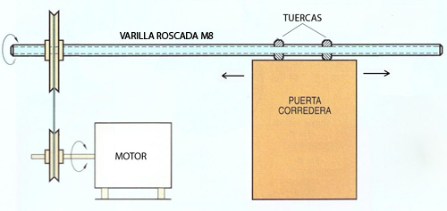

# Puerta automática con control Wi-Fi

### IES Torre Atalaya
Realizado por:
* Carlos Rodríguez
* Mario Gómez
* Javier Figueroa

Profesor: Jose Antonio Romero
## Resumen
Nuestro proyecto de tecnología consiste en la construcción de una puerta corredera automática y controlada inalámbricamente mediante Wi-Fi, por ejemplo con un smartphone.

## Diseño mecánico
El diseño mecánico de la puerta corredera está basado en el mecanismo "tornillo-tuerca", donde un motor eléctrico, mediante un sistema de poleas y correa, hace girar el tornillo (varilla roscada) que consigue que la puerta se deslice al estar fijada a dos tuercas que están insertadas en la varilla roscada. Para mejorar la suavidad de funcionamiento, la varilla roscada está sujeta mediante dos rodamientos de bolas.

Materiales para la construcción:
* chapas y listones de madera para la estructura (recuperados)
* varilla roscada M8 y tuercas (ferretería)
* 2 rodamientos de bolas (reusados de rueda patín)
* motor eléctrico (reusado de lector DVD)

## Diseño electrónica

Para controlar nuestra puerta hemos usado un módulo ESP8266 con firmware NodeMCU. Este módulo tiene un microcontrolador que se puede programar usando el lenguaje Lua y además tiene conectividad Wi-Fi. Con ayuda de unos interruptores fin de carrera podemos detectar cuando la puerta llega al final de la apertura o cierre. También hemos usado un sensor de obstáculos por infrarrojos para detectar obstaculos en el camino de la puerta y poder evitar accidentes. El motor lo controlamos con ayuda de un circuito integrado L293 que se encarga de dar corriente al motor y cambiar la polaridad dependiendo del estado de dos salidas de nuestro módulo ESP8266.

## Programación

## Aplicacición móvil

La [App para Android está disponible en la galería](http://ai2.appinventor.mit.edu/?galleryId=6638221398900736) de [App Inventor](http://ai2.appinventor.mit.edu). Se puede buscar por el nombre (App Puerta Wi-Fi). También se ha exportado e incluido en el repositorio [APP_Puerta.aia](AppInventor2/APP_Puerta.aia)
## Referencias

