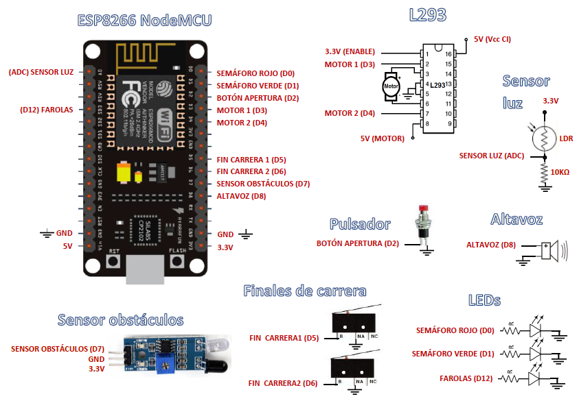
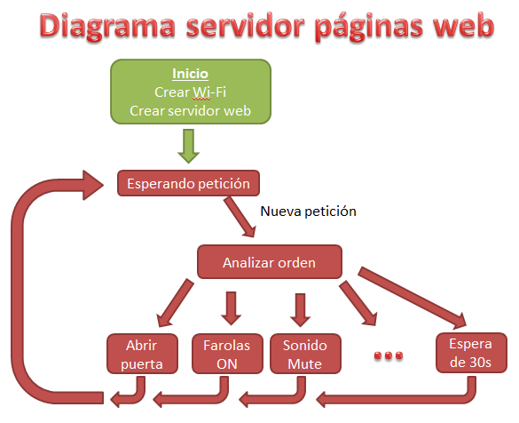

# Puerta automática con control Wi-Fi

### IES Torre Atalaya (3º ESO)
Realizado por:
* Carlos Rodríguez
* Mario Gómez
* Javier Figueroa

Profesor: José Antonio Romero
## Resumen
Nuestro proyecto de tecnología consiste en la construcción de una puerta corredera automática y controlada inalámbricamente mediante Wi-Fi con un navegador web o una aplicación para móvil.

El funcionamiento de la puerta es el siguiente: 
1. Cuando pulsamos el botón de apertura, el semáforo se pone en rojo, empieza a sonar un zumbido a intervalos regulares para alertar del movimiento de la puerta y la puerta comienza a abrirse. 
2. Cuando la puerta se abre totalmente, se detiene, Se para el zumbido y se pone el semáforo en verde. Permanecerá abierta durante el intervalo de tiempo que tenga programado.
3. Después del periodo de apertura programado, el semáforo se pone en rojo, el zumbido empieza a sonar y la puerta se cierra.
4. Si durante el cierre se detecta un obstáculo en el camino de la puerta, la puerta retrocede a la posición de apertura y el zumbido suena con más frecuencia. Se continúa en el paso 2.
5. Cuando la puerta se cierra totalmente se detiene la puerta, se apaga el semáforo y el zumbido.

Además de esto se comprueba regularmente el nivel de luz ambiente mediante un sensor y cuando el nivel de luz baja se encienden las farolas de la calle. Cuando el nivel de luz es alto, las farolas se apagan.Esto es una forma de ahorrar electricidad ya que bien calibradas las farolas solo se encenderan cuando sea necesario.

El control del sistema lo realiza un módulo ESP8266 con conexión Wi-Fi. Hemos programado una página web que permite controlar y programar la puerta. A **través de la Wi-Fi** se puede:
* abrir la puerta
* cambiar el tiempo de apertura de la puerta
* cambiar el volumen del altavoz
* apagar o encender las farolas o activar su funcionamiento automático

Estas funciones se pueden realizar a través de un **navegador web** una vez que nos hemos conectado al punto de acceso Wi-Fi que genera el módulo ESP (en nuestro caso: PuertaWiFi , clave: torreatalaya). La dirección de la página web es http://192.168.4.1

También podemos usar la **aplicación Android** que hemos desarrollado con App Inventor para controlar la puerta y realizar las mismas funciones que hay en la página web.

## Diseño mecánico
El diseño mecánico de la puerta corredera está basado en el mecanismo "tornillo-tuerca",un mecanismo que combierte el movimiento gitatorio de un tornillo en el avance lineal de una tuerca, en nuestro proyecto, un motor eléctrico mediante un sistema de poleas y correa, hace girar el tornillo (varilla roscada) que consigue que la puerta se deslice al estar fijada a dos tuercas que están insertadas en la varilla roscada. Para mejorar la suavidad de funcionamiento, la varilla roscada está sujeta mediante dos rodamientos de bolas.


Materiales para la construcción:
* chapas y listones de madera para la estructura (recuperados)
* varilla roscada M8 y tuercas (ferretería)
* 2 rodamientos de bolas (reusados de rueda patín)
* motor eléctrico (reusado de lector DVD)

## Diseño de la electrónica

Para controlar nuestra puerta hemos usado un módulo ESP8266 con firmware NodeMCU. Este módulo tiene un microcontrolador que se puede programar usando el lenguaje Lua y además tiene conectividad Wi-Fi. Con ayuda de unos interruptores fin de carrera podemos detectar cuándo la puerta llega al final de la apertura o cierre. También hemos usado un sensor de obstáculos por infrarrojos para detectar obstáculos en el camino de la puerta y poder evitar accidentes. El motor lo controlamos con ayuda de un circuito integrado L293 que se encarga de dar corriente al motor y cambiar la polaridad dependiendo del estado de dos salidas de nuestro módulo ESP8266.

Los componentes electrónicos que no hemos reusado y recuperado de viejos aparatos, los hemos comprado por ebay en tiendas de electrónica. El componente más caro es el módulo ESP8266 que ha costado sobre 6 euros en una tienda española de ebay.

Materiales para la electrónica:
* placa de desarrollo ESP8266 NodeMCU DEVKIT (para control, es *open hardware*)
* circuito integrado L293 (para dar corriente al motor)
* LED rojo y verde, y resistencia 220 Ohms (semáforo)
* pulsador (botón apertura)
* sensor infrarrojos (obstáculos) 
* 2 interruptores final de carrera
* altavoz (reusado de una impresora)
* LDR (fotoresistencia) y resistencia 10 KOhms (para sensor luz)
* 2 LEDS blancos y resistencia 220 Ohms (farolas)
* cables de conexión (reusados de cables de red)
* placa de conexiones protoboard para el montaje



## Programación

La programación el módulo ESP que controla la puerta se ha realizado usando el lenguaje Lua y el firmware NodeMCU para ESP8266. NodeMCU proporciona funciones sencillas para configurar la Wi-Fi o controlar las salidas y entradas digitales del módulo (GPIO). Algunos de los módulos del firmware NodeMCU que hemos utilizado son:
* wifi: para crear una red Wi-Fi
* gpio: para controlar las salidas y entradas digitales del módulo
* adc: para leer la entrada analógica del módulo y poder medir la intensidad de luz
* tmr: para crear temporizadores
* pwm: para generar una onda y hacer sonar un pitido en el altavoz
* net: para crear un servidor de páginas web

Para la mayoría de los problemas de programación que hemos tenido que resolver hemos seguido los ejemplos que se pueden encontrar en la [documentación módulos del firmware NodeMCU](https://nodemcu.readthedocs.io/en/master/en/). Por ejemplo el código necesario para crear una red Wi-Fi es así de sencillo:
```[lua]
   wifi.setmode(wifi.SOFTAP)  -- wifi en modo punto de acceso
   CONFIGURACION={}
   CONFIGURACION.ssid="PuertaWiFi"  -- nombre wifi
   CONFIGURACION.pwd="torreatalaya" -- clave
   wifi.ap.config(CONFIGURACION)
```

El firmware NodeMCU busca y ejecuta el programa ```init.lua``` al arrancar el módulo. Desde este programa nosotros ejecutamos el programa principal ```programa.lua``` que a su vez ejecuta ```sonido.lua``` y ```wifi.lua```. En  ```wifi.lua``` tenemos la configuración Wi-Fi y el servidor de páginas web. En ```sonido.lua``` tenemos funciones para generar pitidos en nuestro altavoz. Y en ```programa.lua``` es donde están las funciones que controlan la puerta.

Para controlar la puerta mantenemos en una variable el estado actual de la puerta (cerrado, abriendo, abierto o cerrando) y atendiendo a los eventos que ocurren vamos cambiando de estado activando en cada uno de ellos las señales necesarias para controlar el motor, el semáforo y el sonido.


Los cambios de estado en nuestro sistema son provocados por las conexiones de entrada desde diferentes partes del circuito: el pulsador de apertura, los dos finales de carrera y el sensor de obstáculos. Cuando cualquiera de estas conexiones de entrada cambia de estado se lanza una función como respuesta que comprueba el estado en el que se encuentra la puerta y si es necesario, cambia al nuevo estado activando las salidas necesarias (motor, semáforo, ...). Mediante el módulo ```gpio``` de NodeMCU se puede programar una función de respuesta a una señal externa conectada a una entrada. Por ejemplo, si queremos que cuando pulsemos el pulsador conectando a la entrada 2 de nuestro módulo se lance la función ```boton``` tenemos que usar las dos funciones ```gpio.mode``` y ```gpio.trig``` así:
```
  pulsador=2
  
  -- configuramos la entrada pulsador (2)
  -- pulsador funciona como una interrupción y normalmente está a nivel alto
  gpio.mode(pulsador, gpio.INT, gpio.PULLUP)  
  
  -- configuramos la función de respuesta a la entrada pulsador
  -- lanza la función "boton" cuando pulsador esté a nivel bajo ("down")
  gpio.trig(pulsador, "down", boton) 
```
En nuestro circuito todas las señales de entrada (pulsador, fines de carrera, sensor de obstáculos) actuan cuando se conectan a cero voltios (GND).

### Servidor de páginas web

Al arrancar el ```programa.lua```  se ejecuta ```wifi.lua``` donde se crea un servidor de páginas web que queda pendiente de las peticiones que lleguen por la red Wi-Fi. El servidor queda a la escucha en ```http://192.168.4.1```


Para crear el servidor de páginas web y cómo controlarlo desde una aplicación móvil nos hemos basado en dos tutoriales: [servidor web](http://randomnerdtutorials.com/esp8266-web-server/) y [aplicación android](http://randomnerdtutorials.com/esp8266-controlled-with-android-app-mit-app-inventor/)

Cuando llega una petición analizamos su contenido y actuamos en consecuencia. Por ejemplo para abrir la puerta, cuando llega la petición ```http://192.168.4.1/?abrir``` al servidor de páginas web, llamamos a la función ```boton()``` que es la misma que se ejecuta cuando se pulsa el botón de apertura. Para cambiar el volumen del altavoz o el tiempo de apertura de la puerta, lo que hacemos es cambiar el valor de las variables que almacenan estos parámetros.



### Control automático de iluminación

También tenemos un temporizador que cada segundo lee el nivel de luz ambiente y dependiendo de si está por encima o por debajo de cierto umbral se apagan o encienden las luces de las farolas que tenemos en nuestra maqueta. Para activar o desactivar esta función automática, sólo hay que poner en marcha o parar el temporizador que ejecuta esta función periódicamente.

Este es el código que crea un temporizador llamado luminosidad y lo registra para que se ejecute cada segundo:
```[lua]
   luminosidad=tmr.create()
   luminosidad:register(1000, tmr.ALARM_AUTO, function (timer)
      luz = adc.read(0)--leo nivel de luz
      print("nivel luz "..luz)
      if luz < niveldeluz then
        gpio.write(farolas,1)
      else
        gpio.write(farolas,0)
      end
   end) 
```
Después de esto sólo queda ponerlo en marcha o detenerlo para activar o desactivar el control automático del alumbrado. Se puede hacer con las órdenes lua:

```[lua]
   luminosidad:start()
   
   luminosidad:stop()
```


## Aplicación móvil

Hemos diseñado una sencilla aplicación móvil para controlar la puerta usando App Inventor, una herramienta online para programar aplicaciones Android, muy visual y que permiter programar usando bloques.

Por ejemplo en la página principal de nuestra App hay un botón para abrir la puerta:


La función que realiza este botón es llamar a la página web de nuestro módulo ESP con el parámetro abrir (```http://192.168.4.1/?abrir```), que será detectado por nuestro código y lanzará la misma función que se ejecuta cuando se pulsa físicamente el pulsador de apertura.


La [App para Android está disponible en la galería](http://ai2.appinventor.mit.edu/?galleryId=6638221398900736) de App Inventor. Se puede buscar por el nombre (App Puerta Wi-Fi). También se ha exportado e incluido en el repositorio ( [APP_Puerta.aia](AppInventor2/APP_Puerta.aia) , [APP_Puerta.apk](AppInventor2/APP_Puerta.apk) )
## Referencias

[Documentación módulos del firmware NodeMCU](https://nodemcu.readthedocs.io/en/master/en/)

[Drivers windows para conectar con la placa de desarrollo NodeMCU DEVKIT](https://www.pololu.com/docs/0J7/all)

[ESPlorer: para trabajar y conectarnos con el ESP8266 NodeMCU](https://esp8266.ru/esplorer/)

[MIT App Inventor](http://ai2.appinventor.mit.edu)

[Tutorial servidor web en ESP8266](http://randomnerdtutorials.com/esp8266-web-server/)

[Tutorial control con aplicación android en ESP8266](http://randomnerdtutorials.com/esp8266-controlled-with-android-app-mit-app-inventor/)

[Función para evitar rebotes en la pulsación de un botón](https://gist.github.com/marcelstoer/59563e791effa4acb65f)

[Circuito L293](http://www.manuelvillasur.com/2012/10/driver-l293d-de-texas-instruments.html)

[ESP8266 NodeMCU DEVKIT - open hardware](https://github.com/nodemcu/nodemcu-devkit-v1.0)
